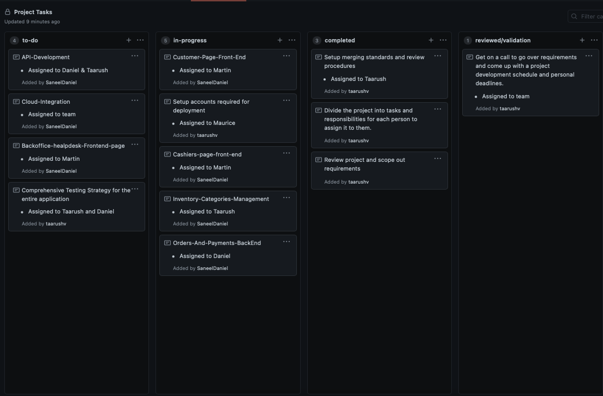

# CMPE 172 - Starbucks Project - Team Journal - Go Team

# Team Project (Go Team)

## Introduction

Problem Statement:

The team has been selected to bid on work for the next version of Starbucks's Online Store and Back office Apps

REQUIREMENTS:

1. Cashier's App (Frontend & Backend)

2. Online Store & Backoffice Help Desk

3. REST API

4. Backoffice Help Desk & Integrations

Team Members: - Martin Vladimirov - Maurice Washington - Saneel Daniel - Taarush Vemulapalli

## { Cashiers App }

Front End managed by Martin Vladimirov, and backend managed by Taarush Vemulapalli

## { Online Store & Backoffice Help Desk }

Front End managed by Martin Vladimirov, and backend managed by Saneel Daniel

## { REST API }

Design and Development to be done by Taarush Vemulapalli and Saneel Daniel

# Team Journal

## Week 1 (Project Kickoff) - (4/16/21 - 4/21/21)

- The team had meetings to discuss the requirements and setup the initial layout.
- We had discussion over responsibility division and task allocations.
- We had brainstorming session on how to start the bare-bones templates and move further from there.
- We concluded the week with task allocations and reviewing the necessary starter codes and will be laying out a boilerplate up within the next couple of days.

