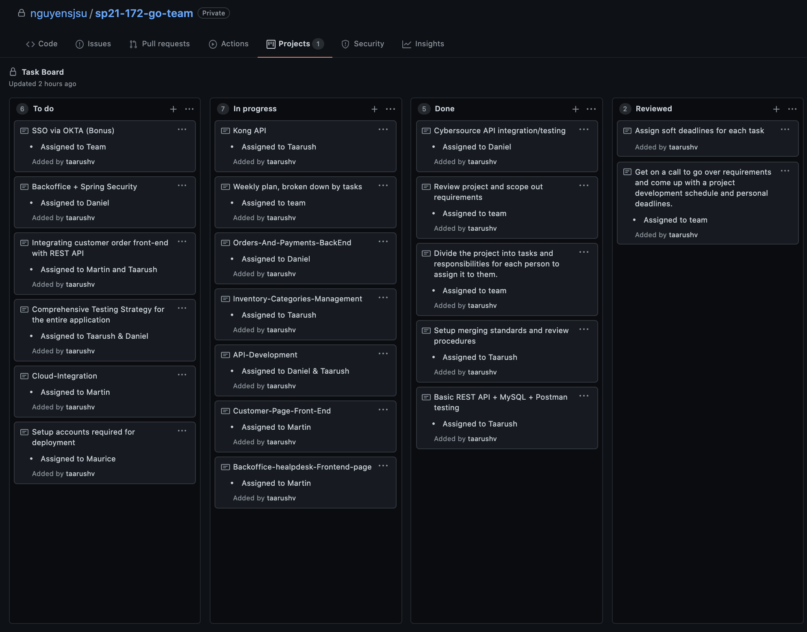
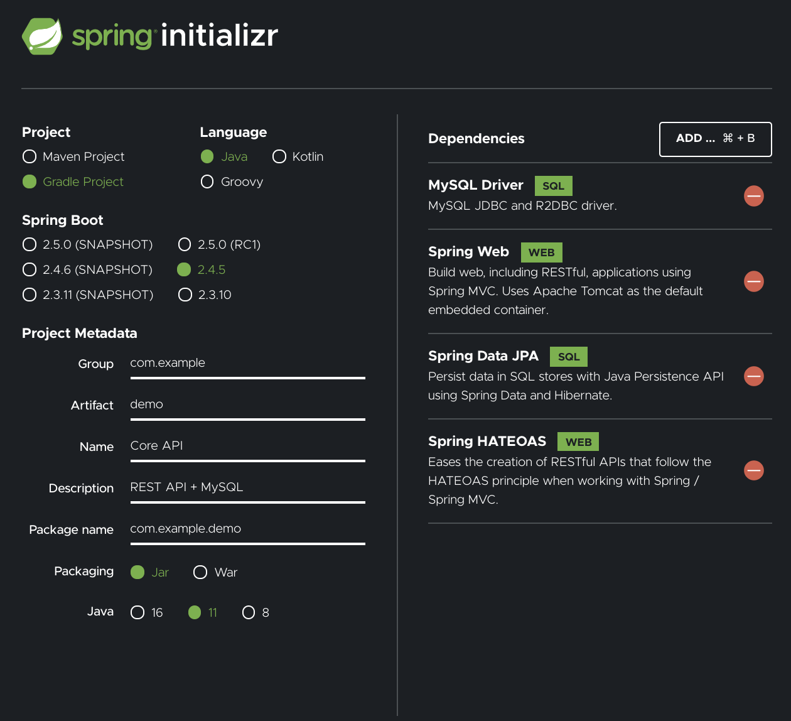
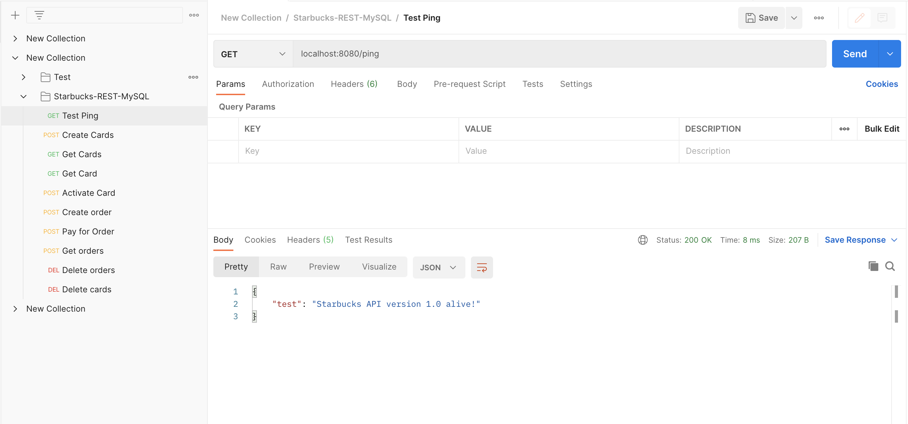

## CMPE 172 - Starbucks Project - Personal Journal - Taarush Vemulapalli

Journal dedicated to log and keep track of my responsibiliites, contributions and lessons learned from challenges while working on this project

### Week 1 

Our primary progress this week revolved around understanding the project requirement and setting goals inorder to submit a scalable and reliable project submission. Moreover we went over everyone's availability inorder to make a schedule that would get us on the track to finishing our project on time. 

My responsibilities and first tasks include working with Daniel to build the backend of the application while also assisting Martin, who is working on the front end, when it comes to fullstack integration. 

Aside from that, I also thoroughly reviewed previous Spring labs and the various Database related labs to get a better understanding on what is required for the project. More importantly to understand which parts of the project we already have a decent grip on and parts of the project which require more research and prototyping. 

Personal Accomplishments for Week (04/22):
* Scoping requirements of the entire project in order to assign individual tasks
* Hosted a call with my teammates to go over the project and make a schedule with realistic soft deadlines and handover specific responsibilites to each partner
* Made a task board on github to track the progress
* Reviewed previous labs and spring starter files to establish a boiler plate for this project
* Reviewed our previous deployment notes to gather procedures relevant to this project

Challenges
* Making a schedule in a way that's sensitive of everyones availablility and our time deadlines for this project
* Making a list of actionable tasks before we attend the class inorder to have my queries addressed. 

### Week 2

Summary: 

Last week we spent a lot of time grasping the scope of the project inorder to make a schedule/taskboard to help us submit our project on time. It ended with Daniel and me splitting the backend responsibilities while Martin agreed to work on our frontend needs. Based on our assigned tasks, I worked on setting up a Spring project with MySQL and REST API. 

The progress of this can be followed on this [branch](https://github.com/nguyensjsu/sp21-172-go-team/tree/taarush/rest-api), with the plan being that we will all work individually until we can merge the entire project on the main branch (and setup docker/deploy scripts in the root folder)

Personal Accomplishments for Week:
* Started working on the REST API using the following spring project

* Created a database schema to ensure the starbucks cards/orders can be integrated into MySQL
* Created sample routes (based on our previous labs) and tested them using postman

* Worked with Daniel on how to divide the responsibilities on the backend (with him agreeing to work on the back office + cybersecure portion of the project)
* Created Makefiles/Docker compose scripts to test parallel MySQL deployments required to boot up our application (setting up table + user credentials)

Challenges
* Debugging REST API setup + finding edge cases where the request fail (particularly when doing database inserts)
* Co-ordinating with our teammates and working with our schedule to make sure everyone is on the same page + ensuring we're not working on the same features (to avoid redundant code/work) 